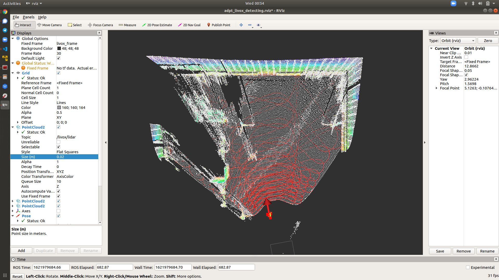

# Livox lidar object detection

The objective of this package is to provide a object detecion solution based on Livox Lidar. In this package, first few (80) lidar frames will be integrated and tranformed as a Kdtree map; each new frames will try to find the nearast neighbor(NN) points in KD-map; for those poings that no NN point can be found in KD-Map, it will be clusted then treat each cluster as a tracking target.

This project is under update, thanks for your reading.

 

## Summary

TO DO

## Installation

TO DO

## Run it

```
roslaunch object_detection adpt_detection.launch
```
 
 ## Contact

For any questions, write to  `qingqli@utu.fi`. 
